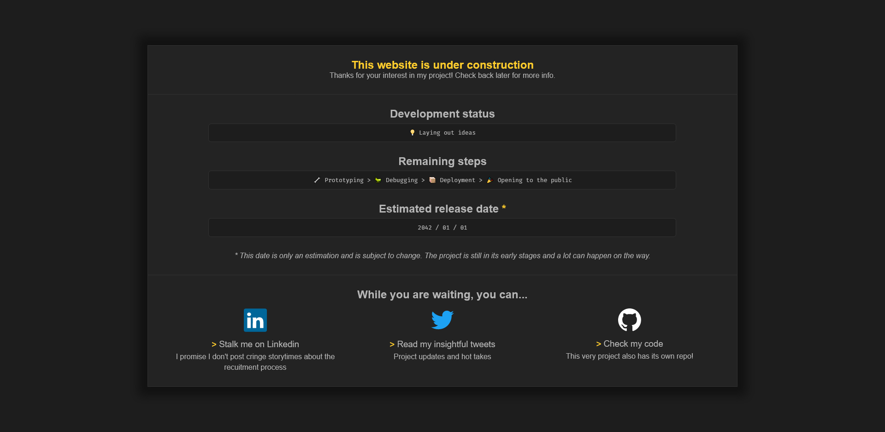

# Simple "Website Under Construction" page

This is a simple and lightweight template to display as a front page on any domain of yours where the project is still under construction.
Beginner-friendly code with no Javascript.

🟡 Original author: [Wolley](https://github.com/wolleydev)



## Editing
Since this is a super simple and straightforward project, everything should be simple and straightforward to edit. If however you need help getting started, keep reading.
> preview.png accounts for most of this folder's size but is only needed for the Readme. If you are going to host a copy of this anywhere, remove it to minimize size.

### Layout
The CSS simulates a 12 column grid in its most basic form. 12 is a nice number that can be divided in 2, 3, 4 and 6, making it pretty versatile.
You can create a grid inside any element of the page by giving it the `.container` class.
Then, give its children classes going from `.c1` to `.c12` to assign them a width equivalent to the number of columns they should occupy.

For instance, splitting a container in two equally sized divs should look like this:
```
<div class = "container">
    <div class = "c6"></div>
    <div class = "c6"></div>
</div>
```
If we wanted to have one div taking up a third of the space and the other div occupying the remaining two thirds:
```
<div class = "container">
     <div class = "c4"></div>
    <div class = "c8"></div>
</div>
```
> the total of columns should amount to 12 if you aim to occupy the full width of the container.

### Style
All the colors used on the page are stored inside CSS variables, which means you can quickly edit the whole look of the page with one color change.
You will find these variables on line 80 in the CSS under the STYLE section.

> To replace anything yellow with a color of your choice, you'll wanna edit the variable `--accent`.

In the HTML, you can add the `.accent` class to any element to change the text color of said element to your accent color.

### Info
Not much to explain here I suppose - go through the HTML and add your own info!

Make sure you don't forget to edit:
+ the meta tags in the `<head>` of the HTML: `author` and `desc` as well as `<title>`
+ your social media URLs and the `title` attributes of the links.

### Social media links
It is recommanded to use a SVG version of the logos and place them under `images/social-media-name.svg`.
> if you want to add more than 3 social media links, don't forget to update the classes on each of them to reflect the appropriate number of columns (see Layout above).

## Enhancement ideas
+ use your own fonts of choice
+ display a countdown using JS instead of a release date


## Additional info
Thanks for checking this very simple project out!

I initially made this template a couple years ago for a website that never saw the light of day. This is a modernized and optimized version made for sharing and reusing.
If you ever end up using it, feel free to drop me a message, I always love to see my creation in the wild.

## Contributing
Feel free to raise issues you may encounter. While this is not actively maintained at all, 
I am not particularly interested in recieving code contributions, 